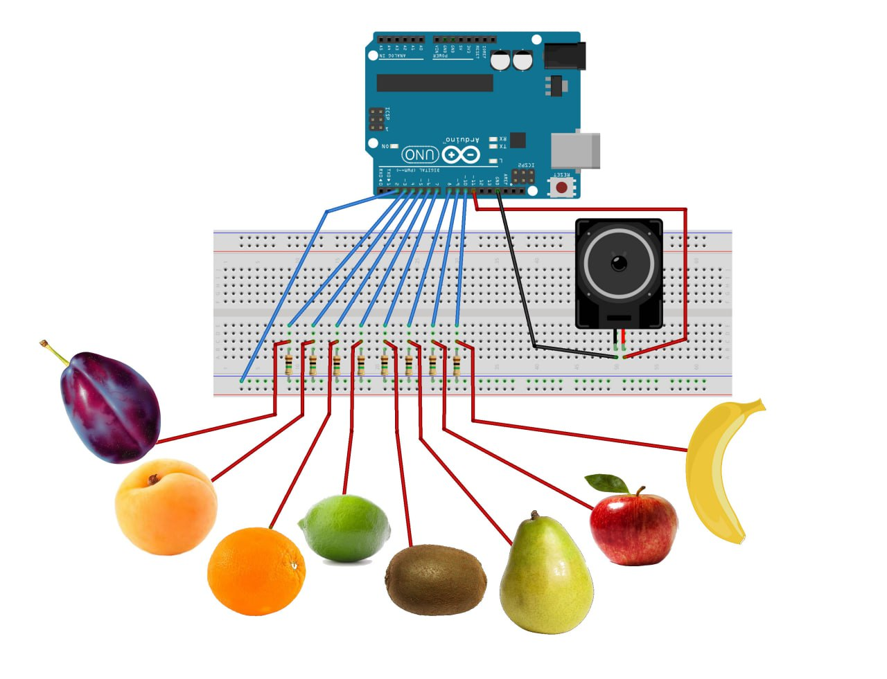

# Fruit-Piano-Arduino
A creative Arduino project that turns fruits into a playable piano using capacitive touch sensing.

---
Touch fruits… and make music 🎵  
This project uses Arduino and capacitive sensing to turn everyday objects into a playable instrument.

---

## 🎥 Demo
Here’s a quick demo of the project in action:

👉 https://www.instagram.com/p/DHZB0AgMxP5/

---

## 💡 Idea
What if fruits could make music? 🍎🎶  
In this project, fruits are used as touch sensors. When you touch them, they play musical notes like a piano!

---

## ⚙️ How it works
Each fruit is connected to the Arduino using wires.  
When you touch the fruit, your body changes the capacitance, and the Arduino detects it and plays a specific note through a speaker.

---

## 🧰 Components
- Arduino board  
- Jumper wires  
- Fruits 🍓🍌🍎  
- Speaker / buzzer  
- CapacitiveSensor library
- Breadboard  
- Resistors (1MΩ or higher recommended)

---

## 🔌 Circuit

---
## 📚 Library Required

Please make sure to install the **CapacitiveSensor** library before uploading the code to Arduino.

You can install it from the Arduino Library Manager:
Sketch → Include Library → Manage Libraries → search for "CapacitiveSensor"

---
## 💻 Code
The code is available in the `/code` folder.

---

## 🌟 Why this project?
This project combines creativity, electronics, and interactive design to make learning Arduino more fun and engaging.

---

## 👩‍💻 Author
With Love Dalia 

---
